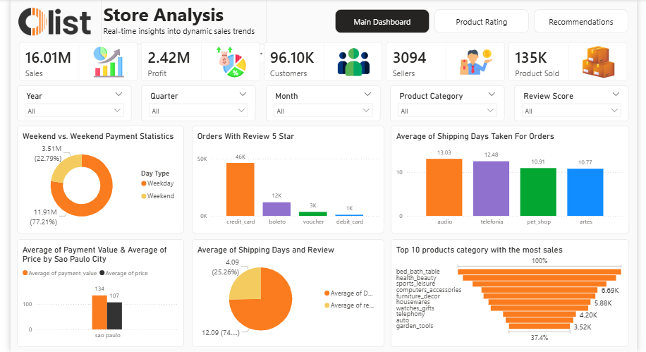
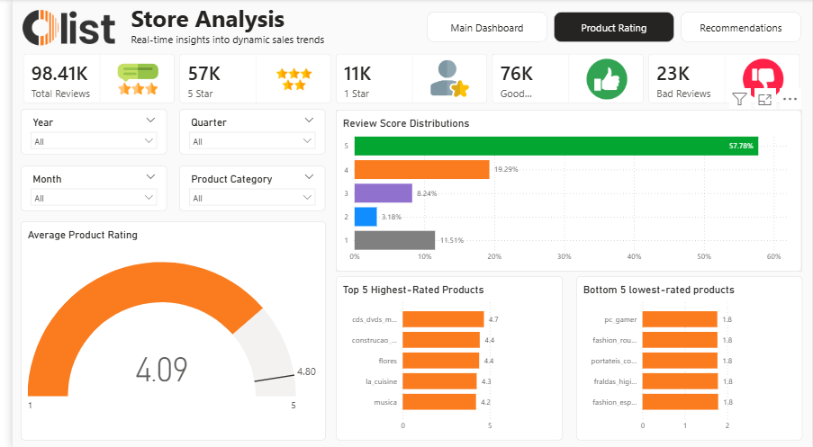
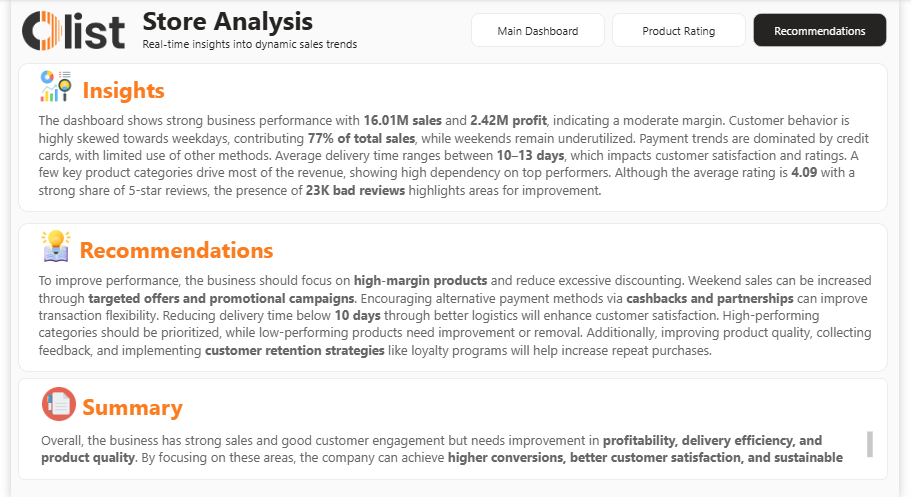

# ecommerce-store-analysis-powerbi
Interactive E-Commerce Store Analysis Dashboard built using Power BI to analyze sales performance, customer reviews, product ratings, shipping efficiency, and business recommendations through data-driven insights.

# E-Commerce Store Analysis Dashboard (Power BI)

## Project Overview

This project is an interactive E-Commerce Store Analysis Dashboard developed using Power BI. The dashboard provides comprehensive insights into sales performance, customer behavior, product ratings, payment methods, shipping efficiency, and business improvement recommendations.

The objective of this project is to transform raw e-commerce data into actionable business insights that support strategic decision-making and improve overall business performance.

---

## Dashboard Preview

### Main Dashboard

### Product Rating Dashboard

### Recommendations Dashboard

---

## Key KPIs

* Total Sales: 16.01M
* Total Profit: 2.42M
* Total Customers: 96.10K
* Total Sellers: 3094
* Total Products Sold: 135K
* Average Product Rating: 4.09

---

## Dashboard Features

### Main Dashboard

* Sales Performance Analysis
* Profit Analysis
* Customer & Seller Insights
* Payment Method Statistics
* Shipping Days Analysis
* Product Category Performance
* Sales Trend Monitoring

### Product Rating Dashboard

* Review Score Distribution
* Average Product Rating Gauge
* Top 5 Highest Rated Products
* Bottom 5 Lowest Rated Products
* Positive & Negative Review Analysis

### Recommendations Dashboard

* Business Insights
* Strategic Recommendations
* Performance Summary
* Customer Satisfaction Analysis
* Profitability Improvement Suggestions

---

## Tools & Technologies Used

* Power BI
* DAX
* Power Query
* Data Modeling
* Data Cleaning
* Data Visualization
* Business Intelligence

---

## Business Insights

* Weekday sales contribute nearly 77% of total sales.
* Credit cards are the most preferred payment method.
* Average shipping duration ranges between 10–13 days.
* Few product categories contribute most of the revenue.
* Average product rating is 4.09 with a high share of 5-star reviews.
* Presence of 23K bad reviews highlights improvement opportunities.

---

## Recommendations

* Focus more on high-margin products.
* Improve weekend sales through targeted campaigns.
* Reduce delivery time for better customer satisfaction.
* Improve low-rated product quality.
* Strengthen customer retention strategies.

---

## Files Included

* Power BI Dashboard File (.pbix)
* Dataset File (.csv / .xlsx)
* Dashboard Screenshots
* README.md

---

## Project Objective

The objective of this dashboard is to help businesses:

* Monitor sales and profit trends
* Analyze customer behavior
* Improve product quality
* Enhance delivery performance
* Support data-driven business decisions

---

## Skills Demonstrated

* Data Analysis
* Dashboard Development
* Data Visualization
* Business Intelligence
* DAX Calculations
* Data Cleaning
* Analytical Thinking
* Business Problem Solving

---

## Author

Aniket Kamble
